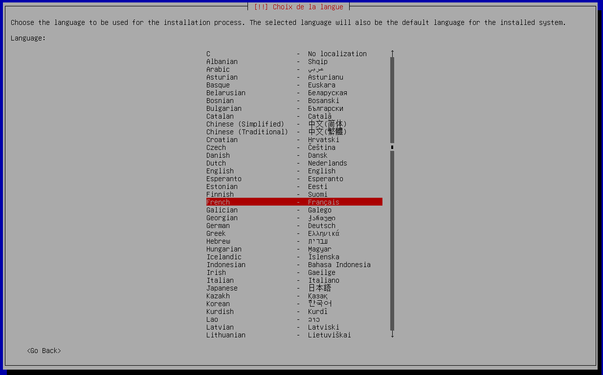
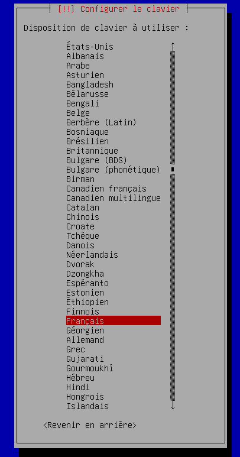
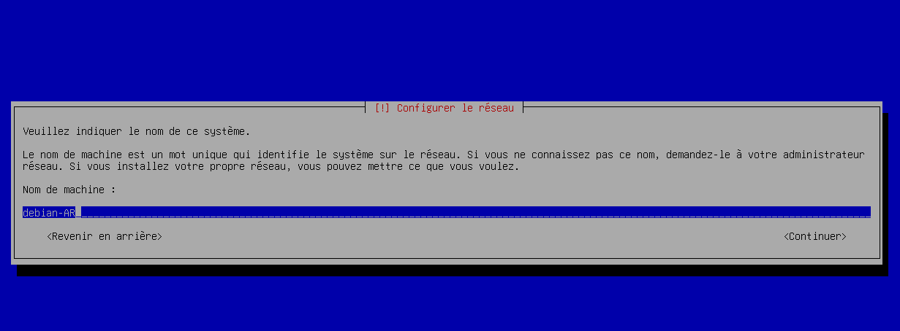
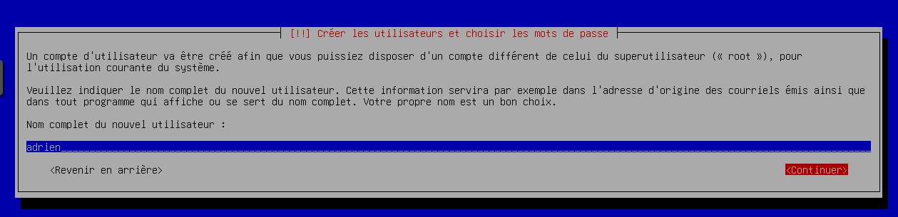
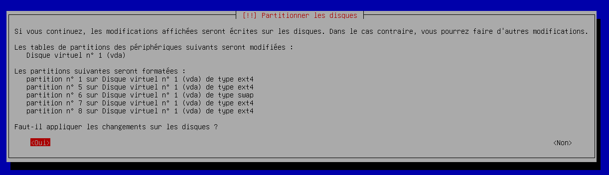
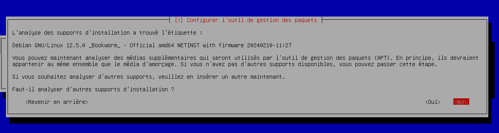
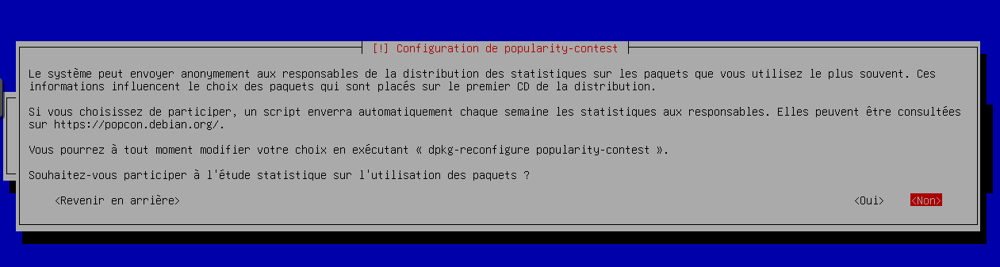
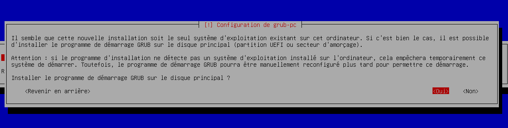
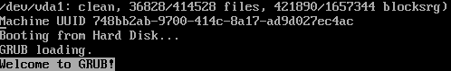

# Installation VM ProxMox

<h1><ins>Créer la VM</ins></h1>

- Cliquer sur le bouton __Créer une VM__ :

<h2>Système d'exploitation</h2>

- Utiliser une image de média (ISO)
- - debian-12.5.0-amd64-netinst.iso

<h2>Système</h2>

- Laisser par défaut

<h2>Disques</h2>

- Bus/périphérique:
- - VirtIO Block

<h2>Processeur</h2>

- Coeur :
- - choisir entre 1 et 3 coeur

<h2>Mémoire</h2>

- Laisser par défaut

<h2>Réseau</h2>

- Laisser par défaut

<h2>Confirmer/h2>

<h1><ins>Installer Debian</ins></h1>

<h2>Choisir la langue</h2>

- Ici nous installerons Debian en français.

<h2>Choisir la localisation</h2>

- Ici nous installerons Debian en France.

<h2>Choisir le language du clavier</h2>

- Le clavier que nous utiliserons sera français et donc AZERTY. 

<h2>Choisir le nom de la machine</h2>

- Mettez un nom de machine commencant par "debian" et finissant par vos initiaux, notez que le nom de la machine et vos initiaux sont séparés par un tiret.

<h2>Choisir le domaine</h2>

- Laisser par défaut.

<h2>Choisir le mot de passe du duper utilisateur (root)</h2>

- Prenez un mot de passe facile pour le mot de passe du super utilisateur.

<h2>Choisir le login de l'utilisateur par défaut</h2>

- Mettez votre prénom en nom d'utilisateur par défaut.

<h2>Choisir le mot de passe de l'utilisateur par défaut</h2>

- Choisissez un mot de passe dont vous vous souviendrez.

<h2>Choisir le/les disques où installer Debian</h2>

- Utilisez un disque entier.

<h2>Schéma de partitionnement</h2>

- Choisissez le schéma de partitionnement : "Partitions /home, /var et /tmp séparées

<h2>Appliquer les changements sur le/les disques</h2>

- Cliquez sur oui.

<h2>Analyser les supports d'installation</h2>

- Cliquez sur non.

<h2>Choisir le pays du miroir de l'archive Debian</h2>

- Dans ce cas nous choisirons la France car c'est le pays le plus proche.

<h2>Choisir le miroir de l'archive Debian</h2>

- Cliquez sur le premier ou le deuxième (c'est la même chose).

<h2>Participer à l'étude statistique sur l'utilisation des paquets</h2>

- Cliquez sur non.

<h2>Logiciels à installer</h2>

- Décocher environnement de bureau Debian et Gnome. Cocher Serveur SSH et utilitaires usuels du système.
- - note : Utilisez la touche <ins>ESPACE</ins> pour cocher et décocher pas <ins>ENTREE</ins>.

<h2>Installer le programme de démarrage GRUB sur le disque principal</h2>

- Cliquez sur oui.

<h2>Choisir le périphérique où sera installé le programme de démarrage</h2>

- Choisir /dev/vda.

<h2>Redémmarrer après l'installation</h2>

- Cliquez sur continuer ou attendre 15 secondes.

<h1>C'est terminer !</h1>

