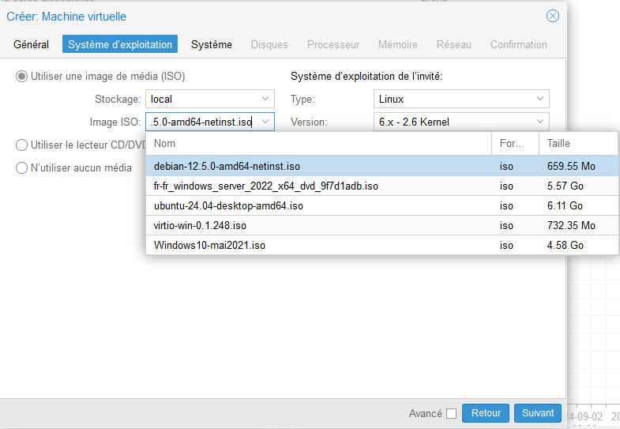

# Installation VM ProxMox

<h1><ins>Créer la VM</ins></h1>

- Cliquer sur le bouton __Créer une VM__ :

<h2>Système d'exploitation</h2>

- Utiliser une image de média (ISO)
- - debian-12.5.0-amd64-netinst.iso

<h2>Système</h2>

- Laisser par défaut

<h2>Disques</h2>

- Bus/périphérique:
- - VirtIO Block

<h2>Processeur</h2>

- Coeur :
- - choisir entre 1 et 3 coeur

<h2>Mémoire</h2>

- Laisser par défaut

<h2>Réseau</h2>

- Laisser par défaut

<h2>Confirmer/h2>
