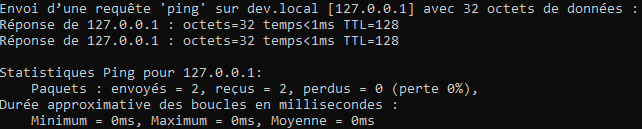
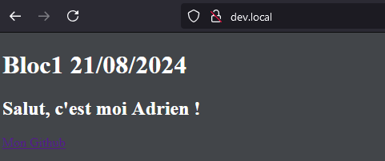
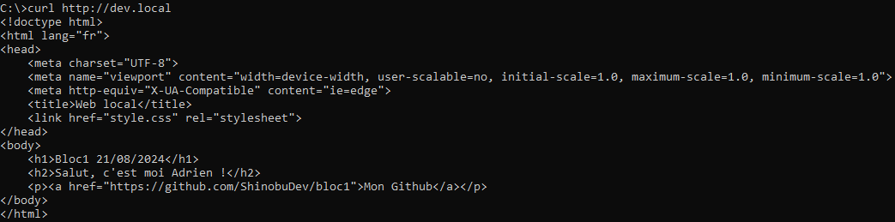
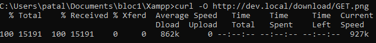

# bloc1

<h1><ins>1 - Méthodes GET et POST</ins></h1>

[__Sources__](https://developer.mozilla.org/fr/docs/Web/HTTP/Methods)

<h2>Méthode GET :</h2>

- La méthode GET demande une représentation de la ressource spécifiée. Les requêtes GET doivent uniquement être utilisées afin de récupérer des données.

GET /index.html

<h2>Méthode POST :</h2>

- La méthode POST est utilisée pour envoyer une entité vers la ressource indiquée. Cela entraîne généralement un changement d'état ou des effets de bord sur le serveur.

<html>
POST / HTTP/1.1
Host: foo.com
Content-Type: application/x-www-form-urlencoded
Content-Length: 13

say=Hi&to=Mom
</html>

<h1><ins>2 – Comparaison méthodes</ins></h1>

[__Sources__](https://developer.mozilla.org/fr/docs/Web/HTTP/Methods)

<table>
  <thead>
    <tr>
      <th scope="col"></th>
      <th scope="col">GET</th>
      <th scope="col">POST</th>
    </tr>
  </thead>
  <tbody>
    <tr>
      <th scope="row">La requête a un corps</th>
      <th scope="row">:x:</th>
      <td>:heavy_check_mark:</td>
    </tr>
    <tr>
      <th scope="row">Une réponse de succès a un corps</th>
      <th scope="row">:heavy_check_mark:</th>
      <td>:heavy_check_mark:</td>
    </tr>
    <tr>
      <th scope="row">Sûre</th>
      <th scope="row">:heavy_check_mark:</th>
      <td>:x:</td>
    </tr>
    <tr>
      <th scope="row">Idempotente</th>
      <th scope="row">:heavy_check_mark:</th>
      <td>:x:</td>
    </tr>
    <tr><th scope="row">Peut être mise en cache</th>
      <th scope="row">:heavy_check_mark:</th>
      <td>:heavy_check_mark:*</td>
    </tr>
    <tr>
      <th scope="row">Autorisée dans les formulaires HTML</th>
      <th scope="row">:heavy_check_mark:</th>
      <td>:heavy_check_mark:</td>
    </tr>
</table>

*Seulement si une information de péremption est incluse.

<h1><ins>3 -Extensible</ins></h1>

[__Sources__](https://fr.wikipedia.org/wiki/Extensible_Markup_Language)

- Sa syntaxe est dite « extensible » car elle permet de définir différents langages avec pour chacun son vocabulaire et sa grammaire.

<h1><ins>4 - Sans état</ins></h1>

[__Sources__](https://www.pierre-giraud.com/http-reseau-securite-cours/introduction-protocole-transfert-hypertexte/)

- Lorsqu’on dit que HTTP est un protocole sans état, cela signifie que HTTP n’a pas besoin que le serveur conserve des informations sur un client entre deux requêtes. Autrement dit, chaque nouvelle requête peut agir de manière totalement indépendante et n’a pas de lien à priori avec les requêtes précédentes ou suivantes.

Par exemple, deux des principes de base du HTTP sont qu’une requête ne peut récupérer qu’une seule ressource à la fois / n’effectuer qu’une action à la fois et que HTTP est un protocole sans état. 

<h1><ins>5 – URL</ins></h1>

[__Sources__](https://www.wpbeginner.com/fr/beginners-guide/website-url-parts-explained-for-beginners/)
[__Source image__](https://www.spreadfamily.fr/glossaire/url)

- Protocole :

La première partie d’une URL est le protocole. Celui-ci définit l’ensemble des règles qui seront utilisées pour transférer des informations entre le serveur et le navigateur de l’utilisateur. Le protocole utilisé pour les sites est HTTP ou HTTPS.

- Nom de domaine :

La deuxième partie importante de l’URL d’un site est le nom de domaine. Il s’agit de l’adresse que les utilisateurs/utilisatrices saisissent dans leur navigateur pour visiter votre site.

- Chemin :

Votre nom de domaine conduira les internautes directement à la page d’accueil de votre site. Mais qu’en est-il s’ils veulent visiter une publication ou une page particulière ? Pour ce faire, ajoutez le chemin d’accès à cette page dans l’URL après le nom de domaine.

- Paramètres :

Ces paramètres sont construits sous la forme d'une liste de paires de clé/valeur dont chaque élément est séparé par une esperluette (&). Le serveur web pourra utiliser ces paramètres pour effectuer des actions supplémentaires avant d'envoyer la ressource. Chaque serveur web possède ses propres règles quant aux paramètres. Afin de les connaître, le mieux est de demander au propriétaire du serveur.

- Ancre :

Enfin, vous pouvez ajouter quelques caractères à la fin d’une URL pour aider les utilisateurs/utilisatrices à accéder rapidement à la section d’une publication qu’ils/elles souhaitent lire. Ces liens sont appelés « liens d’ancrage » et sont formés par l’ajout d’un caractère dièse et d’une ancre après le permalien.

<h1><ins>6 - Codes Status</ins></h1>

[__Sources__](https://developer.mozilla.org/en-US/docs/Web/HTTP/Status)

<h2>1 - Les réponses informatives (100 - 199)</h2>

- 100 Continue

Cette réponse intermédiaire indique que tout est OK pour le moment et que le client peut continuer sa requête ou l'ignorer si celle-ci est déjà finie.

<h2>2 - Les réponses de succès (200 - 299)</h2>

- 202 Accepted

La requête a été reçue mais n'a pas encore été traitée. C'est une réponse évasive, ce qui signifie qu'il n'y a aucun moyen en HTTP d'envoyer une réponse asynchrone ultérieure indiquant le résultat issu du traitement de la requête. Elle est destinée aux cas où un autre processus ou serveur gère la requête, et peut être utile pour faire du traitement par lots.

<h2>3 - Les messages de redirection (300 - 399)</h2>

- 301 Moved Permanently

Ce code de réponse signifie que l'URL de la ressource demandée a été modifiée. Une nouvelle URL est donnée dans la réponse.

<h2>4 - Les erreurs du client (400 - 499)</h2>

- 404 Not Found

Le serveur n'a pas trouvé la ressource demandée. Ce code de réponse est principalement connu pour son apparition fréquente sur le web.

<h2>5 - Les erreurs du serveur (500 - 599)</h2>

- 500 Internal Server Error

Le serveur a rencontré une situation qu'il ne sait pas traiter.

<h1><ins>7 – Négociation de contenu</ins></h1>

[__Sources et images__](https://developer.mozilla.org/fr/docs/Web/HTTP/Content_negotiation#n%C3%A9gociation_men%C3%A9e_par_lagent)

<h3>1 - Les principes de la négociation de contenu</h3>

Un document donné est défini comme une ressource. Lorsqu'un client souhaite obtenir une ressource, il la demande via une URL. Le serveur utilise alors cette URL pour choisir l'une des variantes disponibles. Chaque variante est appelée une représentation. Le serveur renvoie alors une représentation donnée au client. La ressource, ainsi que chacune de ses représentations, dispose d'une URL spécifique. La négociation de contenu détermine quelle représentation donnée est utilisée lorsque la ressource est demandée. Il existe plusieurs méthodes de négociation entre le client et le serveur.

<h3>2 - Négociation de contenu menée par le serveur</h3>

Lors d'une négociation de contenu menée par le serveur (aussi appelée négociation de contenu proactive), le navigateur (ou tout autre agent utilisateur) envoie plusieurs en-têtes HTTP avec l'URL

<h3>3 - Négociation menée par l'agent</h3>

la négociation menée par l'agent, aussi appelée négociation réactive. Dans ce cas, le serveur envoie une page contenant les liens vers les différentes ressources alternatives lorsqu'il reçoit une requête ambigüe. Les ressources seront présentées à l'utilisatrice ou à l'utilisateur, qui choisira celle à utiliser.

<h1><ins>8 – Installation Apache & configuration</ins></h1>

- Ping dev.local

- Site avec Xampp

<h1><ins>9 – CURL</ins></h1>

- Effectuer une requête GET vers l’url http://dev.local

- Effectuer une requête GET vers l’url http://dev.local/notExisting

- Déposer un fichier localement dans le dossier download depuis la racine de votre virtualhost
dev.local et téléchargez-le depuis curl

<h1><ins>10 – Headers</ins></h1>

<table>
  <thead>
    <tr>
      <th scope="col">en-têtes</th>
      <th scope="col">explication</th>
      <th scope="col">illustration</th>
    </tr>
  </thead>
  <tbody>
    <tr>
      <th scope="row">Les en-têtes de requête</th>
      <th scope="row">Contiennent des informations additionnelles à propos de la ressource à récupérer ou à propos du client qui la demande.</th>
      <td>:heavy_check_mark:</td>
    </tr>
    <tr>
      <th scope="row">Les en-têtes de réponse</th>
      <th scope="row">Contiennent des informations supplémentaires au sujet de la réponse (par exemple son emplacement), ou au sujet du serveur qui la fournit.:</th>
      <td>:heavy_check_mark:</td>
    </tr>
    <tr>
      <th scope="row">Les en-têtes de représentation</th>
      <th scope="row">Contiennent des informations à propos du corps de la ressource, comme son type MIME, ou le type de compression ou d'encodage appliqué.</th>
      <td>:x:</td>
    </tr>
    <tr>
      <th scope="row">Les en-têtes de charge utile (payload headers)</th>
      <th scope="row">Contiennent des informations indépendantes de la représentation sur la charge utile, comme la longueur du contenu ou l'encodage utilisé pour le transport.</th>
      <td>:x:</td>
    </tr>
    <tr><th scope="row">En-têtes de bout en bout (end-to-end headers)</th>
      <th scope="row">Ces en-têtes doivent être transmis au destinataire final du message ; c'est-à-dire le serveur dans le cas d'une requête ou le client dans le cas d'une réponse. Les serveurs mandataires intermédiaires doivent retransmettre les en-têtes de bout en bout sans modification et doivent les mettre en cache.</th>
      <td>:heavy_check_mark:*</td>
    </tr>
    <tr>
      <th scope="row">En-têtes de point à point (hop-by-hop headers)</th>
      <th scope="row">Ces en-têtes n'ont de sens que pour une unique connexion de la couche transport et ne doivent pas être retransmis par des serveurs mandataires ou mis en cache. Seuls des en-têtes point à point peuvent être définis avec l'en-tête Connection.</th>
      <td>:heavy_check_mark:</td>
    </tr>
</table>
