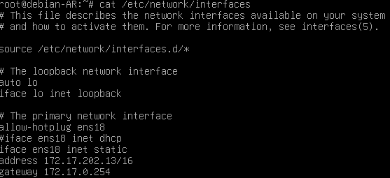
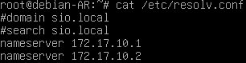
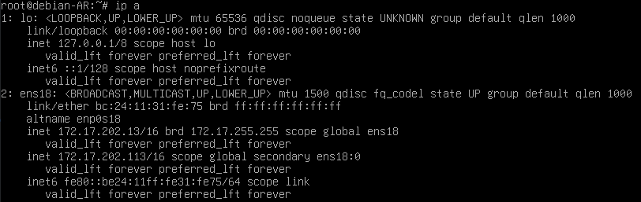
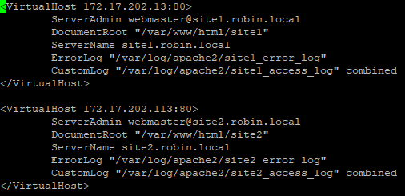
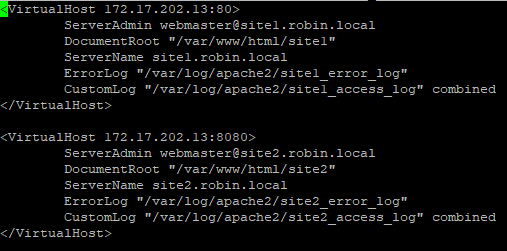
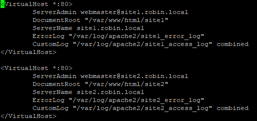
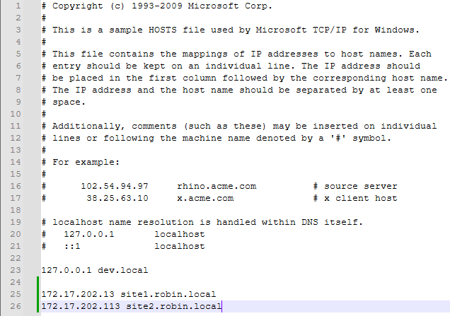

# Faire du multisites apache2 sur Debian 09/12/2024

<a name="Debut" />

<details open>
<summary>Section</summary>

* [Avant toute chose](#Atc)
* [1ere méthode - Utiliser des adresse IP](#1)
* [2eme méthode - Utiliser des ports](#2)
* [3eme méthode - Utiliser des URL](#3)
</details>

<a name="Atc" />

## Avant toutes choses :

### Configurer une IP static

Modifier le fichier interfaces pour changer son IP :



Modifier le fichier resolv.conf pour enlever le domaine de base et le remplacer par une ip fixe :



Relancer Debian avec la commande : ```reboot```

### Installer apache2

Lancer la commande : ```apt install apache2```

Une fois apache2 installé, modifier le fichier html avec ```nano /var/www/html/index.html``` si vous le souhaitez.
(tout les sites crées avec apache2 pourrons être modifier dans ```/var/www/html/leSiteQueTuVeux```)

Mettez votre adresse IP sur votre navigateur pour y accéder.

<a name="1" />

[Revenir au début](#Debut)

## 1ere méthode - Utiliser des adresse IP

### 1 - Mettre en place une seconde adresse IP

Mettre sa deuxième adresse avec la commande ```ip adr add x.x.x.x/16 dev ens18 label ens18:0```
(le 16 après l'adresse IP est le CIDR, pour le masque de sous-réseau)

ens18 est l'ethernet du réseau.
Pour cette deuxième adresse nous renomons ens18 en ens18:0 pour la ne pas faire de conflit.



On peut voir que la deuxième IP est active (première IP ```ens18```, deuxième IP ```ens18:0```)

### 2 - Mettre en place les 2 sites

Créer les fichiers des 2 sites : ```mkdir -p /var/www/html/site1 /var/www/html/site2```

Créer les 2 hôtes virtuel pour les 2 sites: ```nano /etc/apache2/sites-available/CeQueTuVeuxIP.conf``` (créer la fichier pour héberger les sites)

Dans le fichier ```CeQueTuVeuxIP.conf``` mettre en place les 2 sites comme ceci :



### 3 - Redémmarer les serveurs

Après avoir fait ca, les sites ne marchent pas car il faut les activer : ```a2ensite CeQueTuVeuxIP```

Pour vérifier qu'il a bien été ajouter, faites : ```a2query -s```

Puis, redemarrer les services : ```systemctl reload apache2```

L'URL pour mes sites sont ```172.17.202.13``` et ```172.17.202.113```

<a name="2" />

[Revenir au début](#Debut)

## 2eme méthode - Utiliser des ports

### 1 - Mettre en place les sites avec les numéros ports

Copier le fichier pour le changer ensuite : ```cp /etc/apache2/sites-available/CeQueTuVeuxIP.conf /etc/apache2/sites-available/CeQueTuVeuxPort.conf```

Changer le fichier ```CeQueTuVeuxPort.conf``` pour qu'il ressemble a ceci : 



### 2 - Redémmarer les serveurs

Après avoir fait ca, les sites ne marchent pas car il faut les activer (désactiver les sites IP si vous voulez ```a2dissite CeQueTuVeuxIP```) : ```a2ensite CeQueTuVeuxPort```

Puis, redemarrer les services : ```systemctl reload apache2```

L'URL pour mes sites sont ```172.17.202.13:80``` et ```172.17.202.13:8080```

<a name="3" />

[Revenir au début](#Debut)

## 3eme méthode - Utiliser des URL

### 1 - Mettre en place les sites avec des URL

Copier le fichier pour le changer ensuite : ```cp /etc/apache2/sites-available/CeQueTuVeuxPort.conf /etc/apache2/sites-available/CeQueTuVeuxName.conf```

Changer le fichier ```CeQueTuVeuxName.conf``` pour qu'il ressemble a ceci : 



### 2 - Redémmarer les serveurs

Après avoir fait ca, les sites ne marchent pas car il faut les activer (désactiver les sites IP si vous voulez ```a2dissite CeQueTuVeuxPort```) : ```a2ensite CeQueTuVeuxName```

Pour vérifier qu'il a bien été ajouter, faites : ```a2query -s```

Puis, redemarrer les services : ```systemctl reload apache2```

L'URL pour mes sites sont ```site1.robin.local``` et ```site2.robin.local```

Mais les sites ne marcheront pas car il faut les rajouter dans Windows

### 3 - Modifier hosts dans windows

- Éxecuter en Administrateur Notepad++ (ou un équivalent)
- Ouvrir avec Notpad++ ici : ```C:\Windows\System32\drivers\etc\hosts```
- Modifier le fichier en rajoutant l'IP et le nom du site :



L'URL pour mes sites sont ```172.17.202.13:80``` et ```172.17.202.13:8080```, ils fonctionneront cette fois

[Revenir au début](#Debut)
